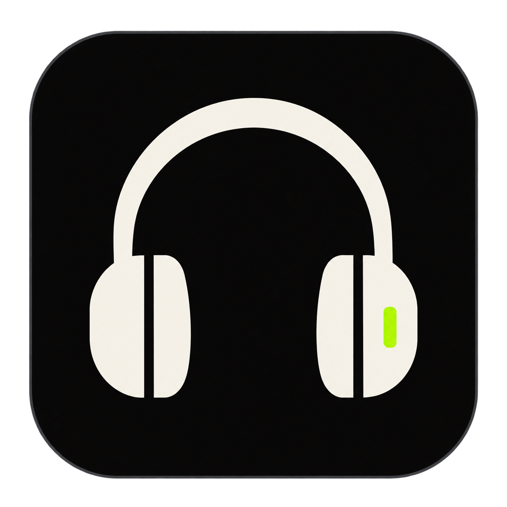
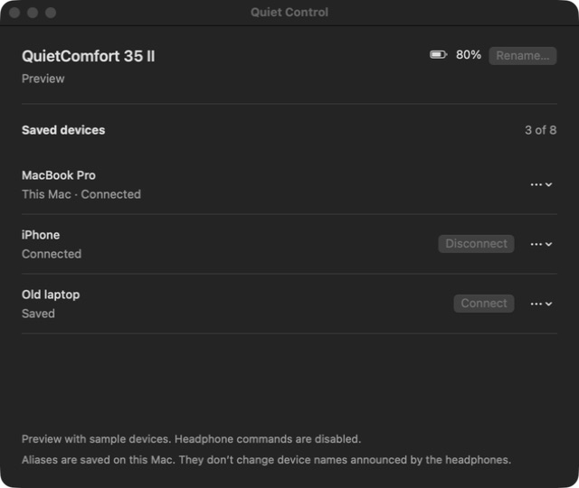
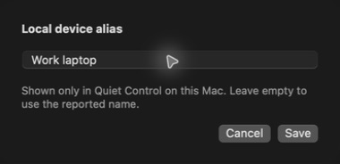

# Quiet Control

A native macOS app for managing the Bluetooth devices remembered by Bose QC35 II
headphones. SwiftUI window and menu-bar entry, with IOBluetooth RFCOMM transport.
No cloud services, third-party packages, or telemetry.



## Build and run

Requires macOS 14 or newer and a Swift 6 toolchain (Xcode or Command Line Tools).

```sh
git clone https://github.com/altaywtf/quiet-control.git
cd quiet-control
swift test
sh scripts/build-app.sh
open 'dist/Quiet Control.app'
```

Pair and connect the headphones in System Settings → Bluetooth. Open Quiet
Control, select the headphones, then choose **Read headphones**. Allow Bluetooth
access if macOS asks. **Refresh** reconnects the control channel and reads the
headphones again.

- Read the saved pairing list, connected states, headphone name, and battery.
- Connect or disconnect another saved device.
- Forget a saved device after confirmation.
- Rename the headphones, with the headset's 31-byte name limit.
- Set local aliases for saved devices through the row menu.

Hardware reads have been tested on a QC35 II. Connect, disconnect, forget, and
headphone rename controls still need hardware verification.



Screenshots use the built-in demo with sample devices.

The current controlling Mac cannot be disconnected or forgotten from this app.
Aliases stay in this Mac's app preferences, keyed by Bluetooth address. They do
not change names stored or announced by the headphones. Renaming the headphones
is a separate operation. There is no known paired-host rename command in the
protocol references below. An old computer name may require re-pairing that
computer after correcting its system name.

Commands time out without automatic retries. An acknowledgement is followed by
read-back; a request being accepted does not by itself mean the device connected.
After an uncertain result, refresh before issuing another command. This prototype
refreshes on demand, rather than interpreting undocumented unsolicited events.

## Development

[QuietCore](Sources/QuietCore/Protocol.swift) handles protocol parsing;
[BluetoothSession](Sources/QuietControl/BluetoothSession.swift) handles RFCOMM;
[HeadphoneModel](Sources/QuietControl/HeadphoneModel.swift) owns UI state and
read-back. The [build script](scripts/build-app.sh) signs the local bundle
ad hoc. It is not notarized.

For a hardware-free UI preview:

```sh
open 'dist/Quiet Control.app' --args --demo
```

Quit the running instance before changing launch arguments. Preview aliases are
kept in memory and headphone commands are disabled.

Read-only protocol inspection, with exactly one Bose headphone connected:

```sh
'dist/Quiet Control.app/Contents/MacOS/QuietControl' --inspect-protocol
```

Quit the normal app first. Inspection verifies the QC35 II product ID, reads
firmware and device-management metadata, and queries extended info for the
controlling Mac. It prints protocol errors and omits peer addresses and names.
GET commands and the app's read-only `GetAllFunctions` discovery action are sent;
no pairing or name changes are attempted.

[Peer-name protocol findings](docs/peer-name-protocol.md) distinguish app-derived
packet definitions, hardware reads, and the rejected peer-name write probe.

## Protocol sources

- [based-connect command implementation](https://github.com/Denton-L/based-connect/blob/ef66145bf4739ec96c1a6959f63146d12ba87e4c/based.c)
  and [types](https://github.com/Denton-L/based-connect/blob/ef66145bf4739ec96c1a6959f63146d12ba87e4c/based.h)
  document the observed wire commands. Upstream is GPL-3.0; this Swift client
  independently implements those protocol messages.
- [bose-macos-utility](https://github.com/lukasz-zet/bose-macos-utility/blob/a4c919f0cfce739f7408d1def190171218df0a6f/bose-macos-utility/bose-macos-utility/AppDelegate.swift)
  demonstrates discovering the macOS `SPP Dev` RFCOMM service.

Run `swift test` for the [protocol and model tests](Tests/QuietCoreTests).

## License and acknowledgements

[MIT](LICENSE) © 2026 Altay Aydemir. This is an independent project, unaffiliated
with Bose.

The protocol references above retain their own licenses and are not bundled
dependencies. The [research notes](docs/peer-name-protocol.md#sources) also credit iclemens/bose,
aaronsb/bosectl, and the Bose Connect packet definitions used to investigate peer
names. No APK or decompiled source is distributed here.
